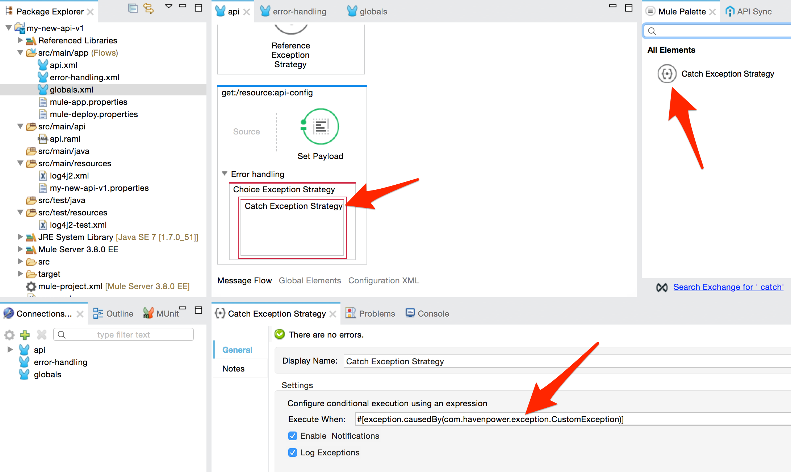

## Description

The API template application should be used every time a new API needs to be implemented. The template pre-implements the following aspects of a Mule API application:

* Properties Configuration
* API Listener (HTTP Listener and APIKit Router)
* Error Handling

Once downloaded into Anypoint Studio, the template can be extended according to the API specifications. Most of the interface specifications would be detailed in RAML file of the API, which can be used to generate skeletons of the flows that implement the API operations.

## Basic Customization

The template is designed to be customized. Basic customization should be done every time the template is used for implementing a new API. The steps below detail the actions to take in order to customize the template after it is imported into Anypoint Studio.

(1) Rename the Anypoint Studio project folder from `api-template-v1` to the actual name of your API. In order to rename the project, right-click on the project root folder in Anypoint Studio, then select **Refactor -> Rename** and type your new project name (e.g. `my-new-api-v1`). Click **OK** to confirm.


(2) Open the `pom.xml` file in the Anypoint Studio project to update it with the actual Maven artifact's coordinates. Update `<groupId>` with the actual package name (e.g. `com.mycompany`). Change `<artifactId>` with the project name that has been set in the step above (e.g. `my-new-api-v1`). Save `pom.xml` file and let Anypoint Studio re-build the project.


(3) Update `log4j2.xml` file under `src/main/resources` by renaming all the occurrences of `api-template-v1` in the `<RollingFile>` with the same name used for the project's root folder above (e.g. `my-new-api-v1`). Leave all the remaining parts of `log4j2.xml` unchanged and just update the `api-template-v1` occurrences where they appear in the file. See picture below for an example.


(4) Rename `api-template-v1.properties` file located in the `src/main/resources` folder using the same name used for the project's root folder (e.g. `my-new-api-v1.properties`). In order to rename the file, right-click on it, then select **Refactor -> Rename** and type the new name. Click **OK** to confirm.


(5) Open `globals.xml` located in `src/main/app` folder, click on the **Global Elements** tab and double-click on **Properties Placeholder (Configuration)** to update the name of the properties files according to the new project's name. Click **OK** to confirm.


## Properties Configuration

This template comes with a default configuration that supports properties files. The properties configuration is contained in the `globals.xml` file under the `src/main/app` folder. The template uses three types of properties files: `api-template-v1.properties`, `api-template-v1-override.properties` and `local.properties`.

> **Note:** Properties files are usually renamed when the template is first customized (see **Basic Customization** section above).

The `api-template-v1.properties` (or equivalent) file is stored under the `src/main/resources` folder and should contain application specific properties. This file **should not contain any sensitive data**, such as passwords or access keys/credentials, because it is supposed to be bundled within the application deployable zip file that is deployed through the cloud [Runtime Manager](https://docs.mulesoft.com/runtime-manager). The kind of properties to store in `api-template-v1.properties` can be URLs, ports, timeouts, polling intervals or anything that can be used to configure the behavior of the application.

The `api-template-v1-override.properties` (or equivalent) file is not bundled within the application deployable zip file. This properties file is generated by the Continuous Integration workflow and it is dropped directly in the configuration folder of the Mule ESB Runtime. The purpose of this properties file is to override some or all the values set in `api-template-v1.properties`, but it can also be used to add other properties related to the environment where the application is supposed to be deployed to. Since `api-template-v1-override.properties` is not bundled within the application deployable zip file and it never leaves the premises, it can contain sensitive data specific to the deployment environment (e.g. systems or database passwords, application access keys, etc.).

The `local.properties` file should be used for development purposes only and it should never be versioned in the Source Version Control system (i.e. Microsoft TFS for Haven Power). This properties file is supposed to live in the Developer's local environment only (e.g. computer, laptop, etc.) and it should be used for overriding potentially all the properties that are set in both `api-template-v1.properties` and `api-template-v1-override.properties` files. Since `local.properties` is neither versioned nor bundled in the application, it can be used for temporarily pointing the Developer's local machine to different remote environments without affecting the other properties files or compromising any sensitive data.

## API Listener

This template provides a pre-built API Listener configuration made of an [HTTP Listener](https://docs.mulesoft.com/mule-user-guide/v/3.8/http-listener-connector) and an [APIKit Router](https://docs.mulesoft.com/apikit/) pointing to a RAML file (`api.raml`) that is located under the `src/main/api` folder.

### HTTP Listener Connector

The HTTP Listener can be configured via properties files in `api-template-v1.properties`. It is possible to change **host**, **port** and **base path** on which the API is listening.

Below the default configuration for the API HTTP Listener provided in this template that should be updated according to the specific project's needs.

```
# API Listener Configuration
api.http.listener.host=0.0.0.0
api.http.listener.port=8081
api.http.listener.path=/api/template/v1/*
```

It is possible to change the HTTP Listener Connector configuration by accessing to the connector declared in the `api.xml` file in `src/main/app` folder. Once in the `api.xml` file, double-click on the **HTTP** icon at the beginning of the flow and navigate to the global HTTP Listener Configuration from the properties configuration window.


### APIKit Router

The APIKit Router is pointing to the `api.raml` file that contains the RAML API specification. This template comes with an example of `api.raml` file, which should be replaced with the actual RAML file for the API that needs to be implemented.

To replace the RAML file, just paste the actual `api.raml` (along with any other JSON or XML resources) in the `src/main/app` folder and replace the existing `api.raml` when prompted to do so. Once the new `api.raml` is in the Anypoint Studio project, right-click on it and select **Mule -> Generate Flows from RAML**. This will generate the skeletons of the operations that need to be implement according to the resources specified in the new RAML file.

The skeletons of the flows can be edited in the `api.xml` Mule configuration file placed in the `src/main/app` folder.


## Error Handling

The API Template comes with embedded Error Handling configuration. This ensures that the most common error scenarios are dealt with consistently and an error response is returned to the caller accordingly.

The Error Handling configuration is specified in the `error-handling.xml` file inside the `src/main/app` folder of the Anypoint Studio project. The configuration is composed of a global [Choice Exception Strategy](https://docs.mulesoft.com/mule-user-guide/v/3.8/choice-exception-strategy) (`global-exception-strategy`) that wraps a number of different [Catch Exception Strategies](https://docs.mulesoft.com/mule-user-guide/v/3.8/catch-exception-strategy), which are executed depending on the type of exception that will be thrown at run time.

The global Choice Exception Strategy is configured on the `api-main` flow inside the `api.xml` file. This ensures that every exception thrown is always caught and dealt with.


### Error Message

Every time an exception is thrown, the Error Handling configuration collects the error information and generates an error response message accordingly. An example of error message is provided below.

```json
{
  "error": {
    "errorCode": "BAD_GATEWAY",
    "errorDateTime": "2016-22-10T20:16:45+0000",
    "errorMessage": "Upstream service unable to fulfil request.",
    "errorDescription": "The request was not validated."
  }
}
```

The table below describes all the fields that are returned in the error response JSON message.

| Field              | Description | Mandatory |
|--------------------|-------------|-----------|
| `errorCode`        | Contains the reason associated to the returned HTTP status code (e.g. `BAD_GATEWAY` for response code `502`). | Yes |
| `errorDateTime`    | Timestamp of when the error has occurred. | Yes |
| `errorMessage`     | High level description of the error occurred within the context of the `errorCode` provided. | No |
| `errorDescription` | Detailed description of the error cause when applicable. | No |

### Extending Error Handling

When an exception is thrown and a match on the exception type is not found, the configuration generates a default error message that is returned to the caller along with `500` HTTP response status code. However, the Error Handling configuration can be extended to include other types of exception by just adding another Catch Exception Strategy to the list of exception strategies in the global Choice Exception Strategy.

### Using Error Handling

It is possible to catch an exception in any parts of the application and generate an error response by using the Error Handling framework.

In order to do so, drag a **Choice Exception Strategy** scope into the **Error Handling** section of the flow of which you want to catch the exceptions.


Once the Choice Exception Strategy scope is positioned, drag a **Catch Exception Strategy** scope inside the Choice Exception Strategy scope and use [Mule Expression Language (MEL)](https://docs.mulesoft.com/mule-user-guide/v/3.8/mule-expression-language-mel) to evaluate the exception type.



Inside the Catch Exception Strategy, you can configure the logic to generate the custom error response according to the type of exception that has been thrown. The error response can be customised by setting the `errorMessage` and `errorDescription` flow variables using a [Variable Transformer](https://docs.mulesoft.com/mule-user-guide/v/3.8/variable-transformer-reference). The error message is finally created by using a [Flow Reference Component](https://docs.mulesoft.com/mule-user-guide/v/3.8/flow-reference-component-reference) that points to one of the pre-built sub flows declared in the `error-handling.xml` configuration file (e.g. `global-resource-not-found-response-sub-flow`). The sub flow ensures that the error response is generated including the appropriate HTTP status code and JSON payload.


The API Template includes the following error response sub flows. Further error response sub flows can be added by just cloning an existing one and changing the **Set Status** and **Set Error Code** components configuration.

| Sub Flow Name                                     | Error Code               | HTTP Status Code |
| --------------------------------------------------|--------------------------|------------------|
| `global-bad-request-response-sub-flow`            | `BAD_REQUEST`            | `400`            |
| `global-resource-not-found-response-sub-flow`     | `RESOURCE_NOT_FOUND`     | `404`            |
| `global-method-not-allowed-response-sub-flow`     | `METHOD_NOT_ALLOWED`     | `405`            |
| `global-not-acceptable-response-sub-flow`         | `NOT_ACCEPTABLE`         | `406`            |
| `global-conflict-response-sub-flow`               | `CONFLICT`               | `409`            |
| `global-unsupported-media-type-response-sub-flow` | `UNSUPPORTED_MEDIA_TYPE` | `415`            |
| `global-internal-server-error-response-sub-flow`  | `INTERNAL_SERVER_ERROR`  | `500`            |
| `global-bad-gateway-response-sub-flow`            | `BAD_GATEWAY`            | `502`            |

Since the Catch Exception Strategy is defined inside a Choice Exception Strategy scope, Mule evaluates the expression defined in the Catch Exception Strategy and if a match is found, the logic inside the Catch Exception Strategy block is executed, otherwise the exception is propagated to the parent flow (i.e. `api-main`), which passes the exception to the global Choice Exception Strategy defined in the `error-handling.xml` configuration file. The global Choice Exception Strategy is executed and if a match is not found, the default error message is generated.
